# ESPHome csillag és csillagköd vetítő űrhajós

**English version coming soon!**

[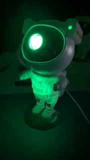](images/img1.jpg)

***Ez az első ilyen formában közzétett projektem, ha bármilyen észrevételed lenne, akkor az építő jellegű javaslatokat szívesen veszem.***

## Az ötlet
Az alap ötlet két projekt kombinációjából származik:
- [3ative - How-to make a 'Galaxy Projector LED Nebula Light' smart and work with Home Assistant](https://youtu.be/YwHWbcuztuY)
- [Nebula Light](https://github.com/kireque/esphome_nebula_light)

## Szituáció
Gyerekeimnek rendeltünk 3db űrhajóst \(éjszakai fénynek\) és két esetet szerettem volna kezelni:
 - Sajnos (mint gondolom a gyerekek döntő többsége) rendszeresen elfelejtenek maguk után lekapcsolni minden világítást a szobájukban.
 - A gyári távirányítóval beállítani a kedvenc színkombinációjukat elég nehézkes: ha bekapcsoltad és visszanyerted a látásod - mert 100% fényerővel égeti ki a retinád -, 10-20 gombnyomással már sikerül is.

## Okosítás
Az űrhajós gyárilag nem rendelkezik a távirányítón kívül semmilyen interface-szel. A fent említett YouTube videó adta az ötletet, hogy ebben sem lesz túl bonyolult a vezérlés \(sőt, sok pénzben mertem volna fogadni, hogy szinte ugyan azt a megoldást fogom megtalálni\), és nem is tévedtem sokat.

### Szétszerelés
A hátizsákon 4 kupak alatt találhatóak meg a csavarok. A kupakok eltávolítása kicsit nehézkes. Én kilyukasztottam, és úgy húztam ki. \(Ha bárki talál rá kevésbé destruktív megoldást, akkor jelezze! 😊\) 

[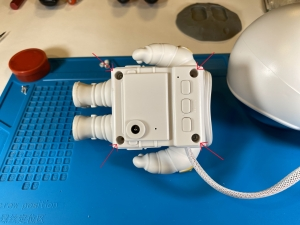](images/img2.jpg)
[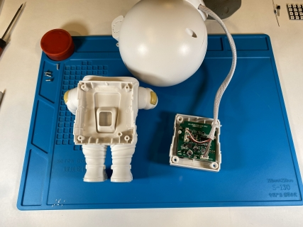](images/img3.jpg)

3 csatlakozó eltávolításával kiszabadítható a NYÁK:

[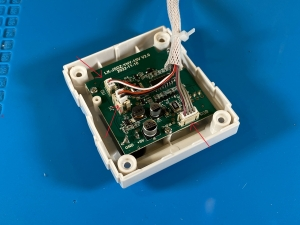](images/img4.jpg)

### Mikrokontroller eltávolítása
Az ötletet adó kivetítőhöz hasonlóan ezen a NYÁK-on is egy kis mikrokontroller van, ami 3.3V-tal működik.
Eltávolításához forrólevegős, vagy hagyományos forrasztópáka szükséges.

[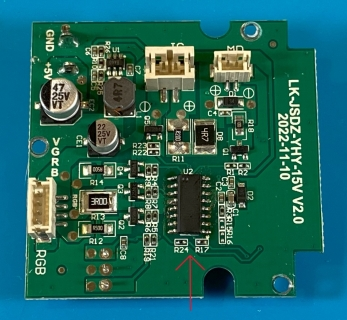](images/img5.jpg)
[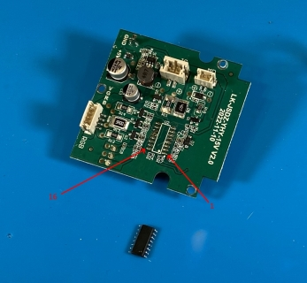](images/img6.jpg)

### Lábkiosztás
Jöhetett a keresés, mi hova van kivezetve. Mivel XYZ típusú N-Channel MOSFET-tel van vezérelve minden, így egyszerűbb feladat volt visszakeresni: Source->GND, Gate->MCU, Drain->Load->VCC.

Kiméregetve a csatlakozók alapján a lábkiosztás:
| Szám | Funkció             | Szám | Funkció
| -    | -                   | -    | -
| 1    | Csillagköd - Kék    | 16   | Nyomógomb - Csillagok
| 2    | Csillagköd - Piros  | 15   | Nyomógomb - Be/Ki
| 3    | Csillagköd - Zöld   | 14   | Nyomógomb - Csillagköd
| 4    |                     | 13   | 
| 5    | Csillagköd - Motor  | 12   | Infravörös vevő
| 6    | Státusz LED (piros) | 11   | Lézer
| 7    | Státusz LED (kék)   | 10   | 
| 8    |                     | 9    | 

### ESP32
"Long story short" - megpróbáltam ESP12-vel is, de a relatív kevés felhasználható I/O port miatt I2C bővítő kellett, emiatt esett a választásom az ESP-WROOM-32 alapú lapkára \(Wemos MINI D1 ESP32 néven fut általában\).

[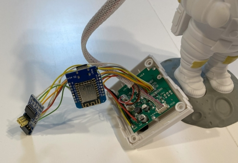](images/img7.jpg)

[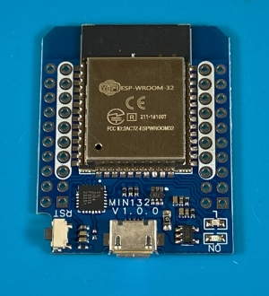](images/img8.jpg)
[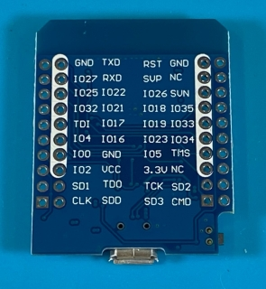](images/img9.jpg)

7.5cm hosszú (0.22mm2) vezetékeket forrasztottam az eredeti mikrokontroller csatlakozási helyeire.

[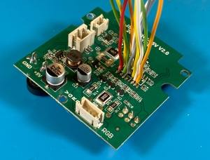](images/img11.jpg)
[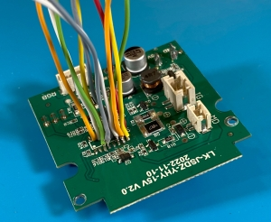](images/img12.jpg)

### Tápegység
Az űrhajós 5V-os USB adapterről működik és bár van rajta 3.3V-os stabilizátor, nem terveztem használni, mindent direktben a betáp csatlakozóra közöttem. A kábelek 7.5cm, illetve 12.5cm hosszúak (0.5mm2).

[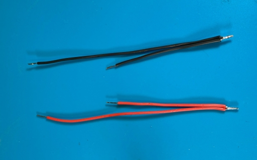](images/img13.jpg)
[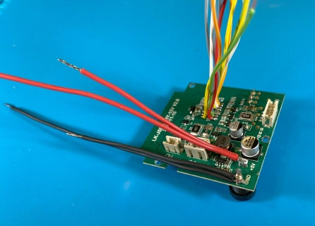](images/img14.jpg)

**A műtét után az űrhajóshoz legalább 2A-es tápegység kell!**

### Extrák
A mellékelt ESPHome kód tartalmaz némi extrát, amit az alábbiak szerint kötöttem be:

**LED \"tábla\" az űrhajós testének, illetve műszereinek megvilágítására**
- GPIO19 -> LED_IN

[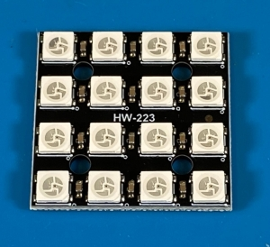](images/img15.jpg)
[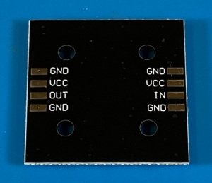](images/img16.jpg)

**Dallas DS18B20 hőmérséklet mérő az úrhajós belső hőmérsékletének méréséhez**
\(Azért terveztem bele, mert az ESP32 belső hőmérséklete 50C feletti értékeket mutatott és nem tudtam, hogy mennyire fog átmelegedni az egész. A tapasztalat azt mutatja, hogy nem létkérdés, kb. szobahőmérséklet van a testében is.\)
- DATA -> GPIO18
- **Vcc -> 3.3V\(!\)**
- Vcc és GPIO18 közé kell egy 4K7 felhúzó ellenállás

[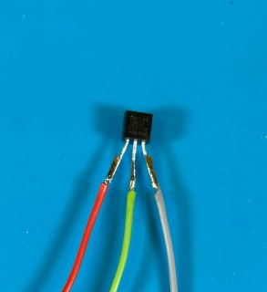](images/img17.jpg)
[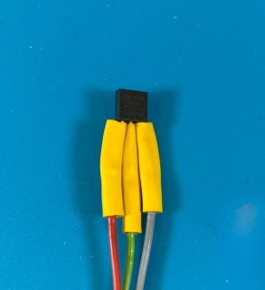](images/img18.jpg)
[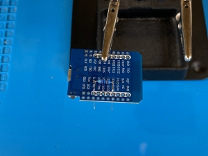](images/img19.jpg)
[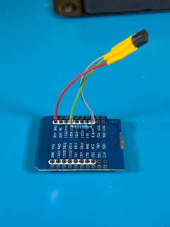](images/img20.jpg)

Együtt az extrák

[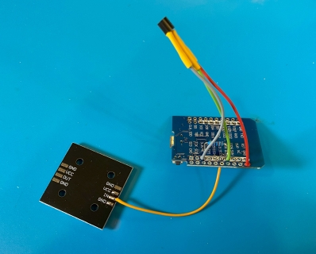](images/img21.jpg)

### Forrasztás!
Az alábbiak szerint kötöttem össze a két NYÁK-ot:

| Csatlakozási pont | Wemos Mini / Digital LED
| -                 | -
| +5V               | VCC
| GND               | GND

| Eredeti IC | Wemos Mini | Funkció
| -          | -          | -
| 1          | GPIO17     | Csillagköd - Kék
| 2          | GPIO21     | Csillagköd - Piros
| 3          | GPIO16     | Csillagköd - Zöld
| 5          | GPIO22     | Csillagköd - Motor
| 6          | GPIO32     | Státusz LED (piros)
| 7          | GPIO27     | Státusz LED (kék)
| 11         | GPIO4      | Lézer
| 12         | GPIO33     | Infravörös vevő
| 14         | GPIO34     | Nyomógomb - Csillagköd
| 15         | GPIO23     | Nyomógomb - Be/Ki
| 16         | GPIO35     | Nyomógomb - Csillagok

Ezt a fázist elég nehéz volt fotózni - fogynak a szabadon lévő kábelek:

[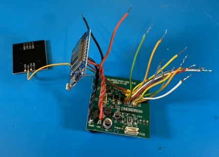](images/img22.jpg)
[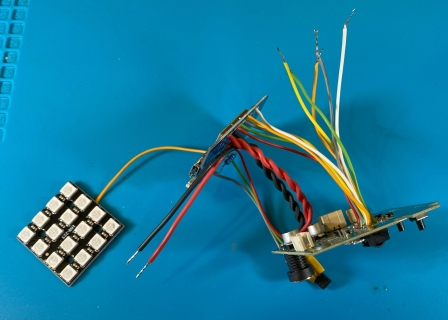](images/img23.jpg)
[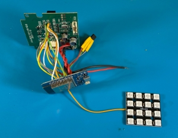](images/img24.jpg)
[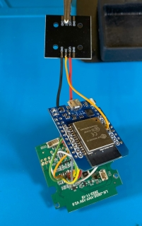](images/img25.jpg)

### Power LED
A Wemos MINI-n gyárilag van egy LED, ami folyamatosan világít, jelezve, hogy van tápfeszültség. Ezt érdemes leszedni, mert átvilágít az űrhajós testén.

[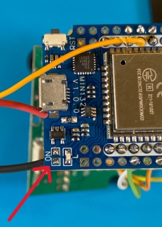](images/img26.jpg)

### LED panel rögzítése
Kétoldalas ragasztóval oldottam meg a LED panel rögzítését, és hogy legyen hely közöttük, 3 réteget ragasztottam egymásra. A panelt úgy pozícionáltam, hogy ne takarja az antennát.

[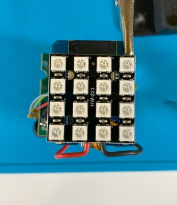](images/img27.jpg)
[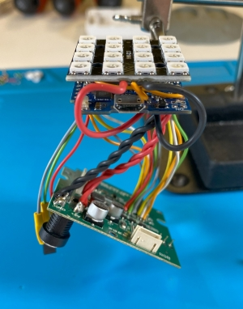](images/img28.jpg)

### Végszerelés, összeállítás
Multiméterrel ellenőriztem a forrasztásokat, majd az eredeti mikrokontrollernél ragasztóval \(glue gun\) rögzítettem a kábeleket.
Kábelkötegelővel szépen össze lehet fogni az egészet és valami ilyesmi lesz a végeredmény:

[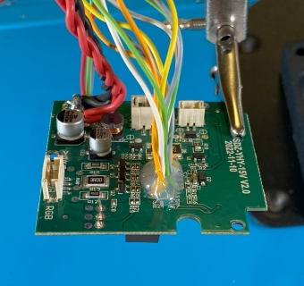](images/img29.jpg)
[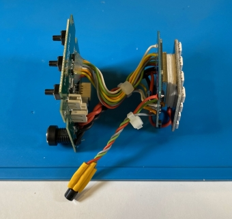](images/img30.jpg)
[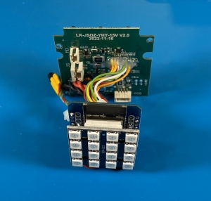](images/img31.jpg)
[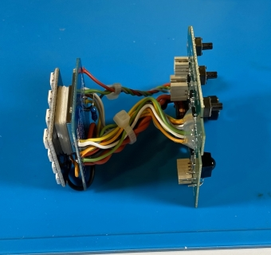](images/img32.jpg)

### Hibajavítás
Összeszerelés és a fotók visszanézése közben észrevettem, hogy nem teljesen egyforma a 3 űrhajós panelja, hiába stimmel a verziója. Az R15 és az R16 ellenállások hiányoznak kettőről, ami a 3.3V felhúzó ellenállások lennének a csillagköd és a csillagok nyomógomboknál. SMD-t és főleg ilyen picit sajnos nem tudnék normálisan felforrasztani, ezért maradt a \"B\" terv: 10K-s ellenállást forrasztottam a mikrokapcsolók lábaira, a másik felét pedig 3.3V-ra kötöttem.

[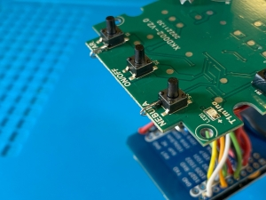](images/img33.jpg)
[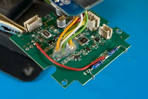](images/img34.jpg)

## Program feltöltése

Készítettem egy alap konfigurációs file-t, ezt be kell másolni az ESPHome-ba: [ESPHome/astronaut.yaml](ESPHome/astronaut.yaml)

Az alábbi részeket javítsd a saját környezetednek megfelelően:
```YAML
substitutions:
  name: <preferált név>

wifi:
  ssid: !secret wifi_ssid
  password: !secret wifi_password

ap:
  ssid: "${name}HotSpot"
  password: !secret wifi_fallback_password

api:
  password: !secret api_password

ota:
  password: !secret ota_password

```

Ha ez megvan, akkor mehet a telepítés. Az első feltöltéshez mindenképp USB kábelen kell csatlakoztatni a Wemos MINI-t!

Feltöltés után Home Assistant-ban értesítés fog megjelenni, hogy új eszközt talált, konfiguráció után meg kell jelennie az eszközök között.

[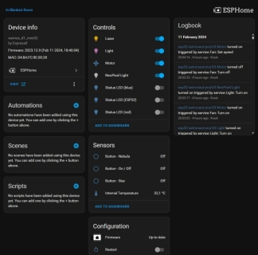](images/img35.jpg)

## Teszt

Még szétszedett állapotban érdemes tesztelni, hogy minden funkció működik-e rendesen, ehhez csak vissza kell dugni a fejből jövő 3 csatlakozót a NYÁK-ra.

[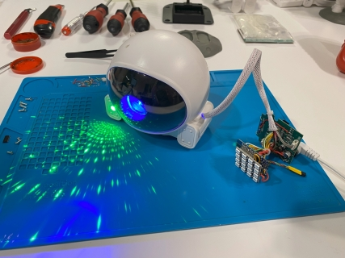](images/img36.jpg)
[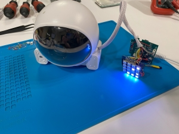](images/img37.jpg)

## Összeszerelés
Az eredeti \"hátizsákban\" alig van hely, így ez nem is volt opció, hogy ide próbáljam meg bezsúfolni az egészet. 35mm átmérőjű körkivágóval 2db egymásba érő lyukat vágtam, ügyelve arra, hogy a rögzítési pontokat ne fúrjam el. Így megfelelően nagy nyílás lett a \"hátán\", hogy könnyedén össze lehessen rakni.
A fúrásnál célszerű lassan és óvatosan haladni, mert a hátizsák merevebb műanyagból van, az űrhajós teste viszont puha. Fúrás előtt ellenőrizd, hogy hova fog esni a kivágás!
Az alábbi képeken látható is, hogy az alsó lyuk kicsit elcsúszott jobbra és épphogy nem nyílt szét az illesztés.

[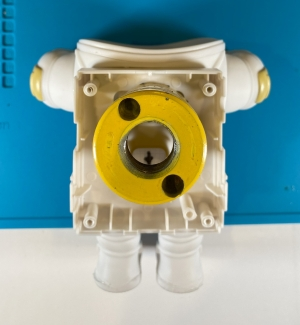](images/img38.jpg)
[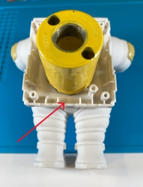](images/img39.jpg)

Fúrás után katasztrófálisan nézett ki nálam mindegyik. Sorjázóval és szikével szépen le lehet takarítani.

[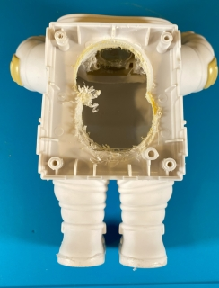](images/img40.jpg)
[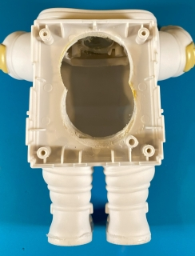](images/img41.jpg)

A mágnesek, amik a fejet tartják, elég gyengén vannak beragasztva, ezt érdemes orvosolni egy kis ragasztóval. Ha \"glue gun\"-t használsz, akkor egyszerre csak egy mágnesre nyomj ragasztót és támaszd meg, mert a hő feloldja a rajta lévő ragasztót és kiugrik a helyéről. Én elsőre sajnos úgy jártam, hogy kiugrott mindkét mágnes, és egy szép kis ragasztó csomóvá állt össze az egész.

[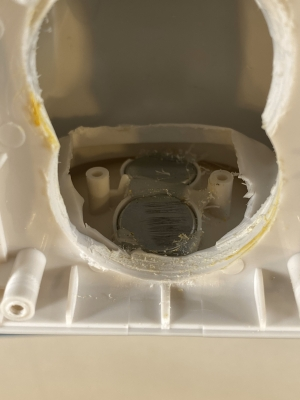](images/img42.jpg)
[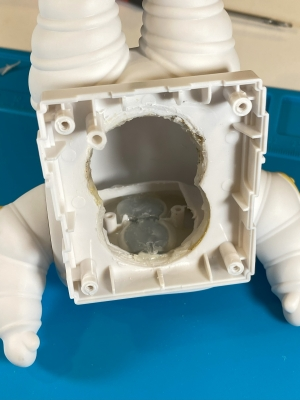](images/img43.jpg)

Ha idáig eljutottál és nincsenek égési sérüléseid, akkor lehet összeszerelni.
Az eredeti NYÁK-ot vissza kell csavarozni a hátizsák hátsó felére, és a fej kábeleit el kell rendezni, hogy a megfelelő helyen \(a kivezetésnél\) legyen.

[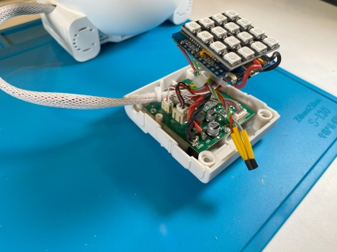](images/img44.jpg)
[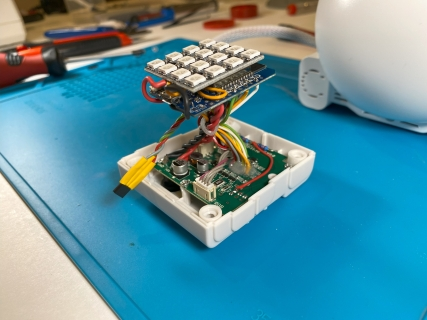](images/img45.jpg)

A hátizsák műanyag eleménél fogva - és egy kicsit oldalra döntve - összeállítható az egész. Arra érdemes figyelni, hogy a LED panel a lehető leginkább felfelé \(a mágnesek felé\) legyen.

[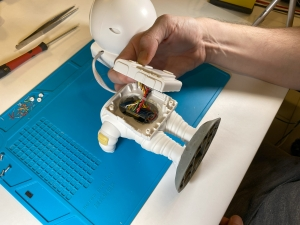](images/img46.jpg)
[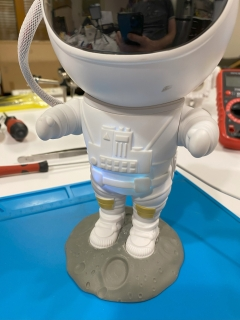](images/img47.jpg)


## TODO
AZ ESPHome konfiguráció nincs teljesen kész.

### Kód optimalizálása
Működik, használható, nem szép...

### Effektek
A csillagköd és a LED panel effektjeit még lehetne szépíteni.

### Offline működés
Utazások alkalmával vinni szoktuk magunkkal, elvileg a \"reboot_timeout\" lesz a megoldás.

### Hátizsák gombok életre keltése
Az eredetihez hasonló funkciókhoz még hiányoznak.

### Távirányító gombok életre keltése
Az eredetihez hasonló funkciókhoz még hiányoznak (minta van a kódban).

**Távirányító kódok:**
| Button name	| Address	| Command
| -     | -  | -
| Power	| 0xFF00	| 0xBA45
| Timer	| 0xFF00	| 0xB847
| Nebula	| 0xFF00	| 0xBB44 
| Nebula B+	| 0xFF00	| 0xF609
| Nebula B-	| 0xFF00	| 0xEA15 
| Nebula S+	| 0xFF00	| 0xBC43 
| Nebula S-	| 0xFF00	| 0xBF40
| Star	| 0xFF00	| 0x00FF
| Star S+	| 0xFF00	| 0xE619 
| Star S-	| 0xFF00	| 0xB946 
| Star B+	| 0xFF00	| 0xF20D
| Star B-	| 0xFF00	| 0xF807 

## Linkek

HEStore:
- [ESP32-D1-MINI](https://www.hestore.hu/prod_10042950.html)
- [WS2812-4X4](https://www.hestore.hu/prod_10041716.html)
- [DS18B20+](https://www.hestore.hu/prod_10028985.html)

Aliexpress (affiliate):
 - [Aliexpress: Astronaut Star Projector Night Light with Remote Control](https://s.click.aliexpress.com/e/_ooTvjn0)
 - [Aliexpress: Wemos D1 MINI ESP32](https://s.click.aliexpress.com/e/_omDf1zG)

## További projektek
Tervezem még közzétenni más projektjeimet is, ahogy időm engedi:

[GitHub](https://github.com/Fecos?tab=repositories) | [YouTube](https://www.youtube.com/channel/UCrv1oaToboV7-kN44UcGDXw)

## Ha támogatnád a munkámat...
Ha hasznosnak találtad ezt a leírást, és köszönenet mondanál, akkor egy ☕, vagy egy 🍺 meghívást szívesen veszek.😊

[](https://www.buymeacoffee.com/fecos) [](https://www.paypal.com/donate/?business=NB972JNT9RSE4&no_recurring=1&currency_code=EUR)
